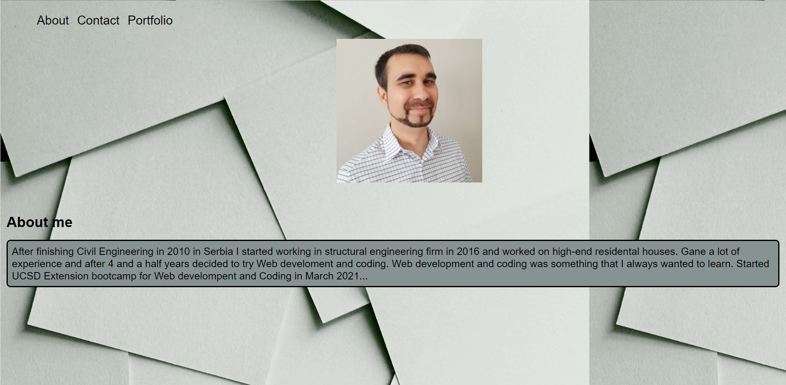
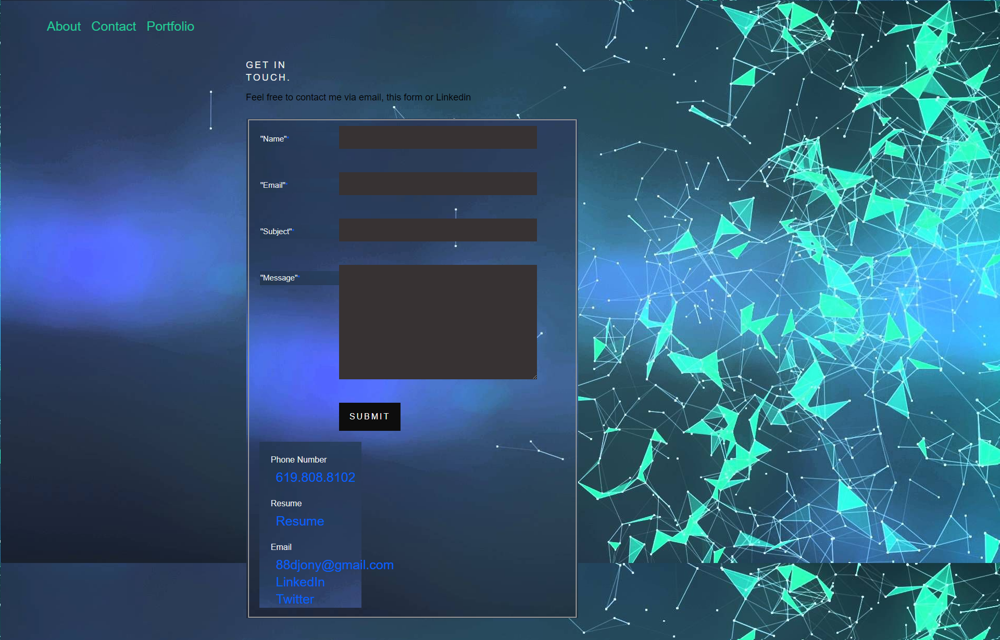

## React Portfolio

UCSD-SD-FSF-PT-03-2021-U-C

[GitHub Link](https://github.com/djony88/20_React_Portfolio)

[Deployed App](https://djony88.github.io/20_React_Portfolio/)

Requirement:

* Creating a single page aplication React portfolio with work samples.
* When opening the app you will see About page with navigation bar, picture and About me section.
* On clicking on Contact a get in touch page opens with message form, phone number(on click it open app for direct call), Resume (on click it downloads PDF resume), email address (on click it opens default email application), Link to Linked in profile and Twitter.
* On clicking on Portfolio it opnes a page with work sampless with screenshots or gif files with name and technologies underneath thats been used to create that app.
* On click on any of the work samples it will take you to deployed app page.

